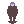
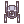

# Symbiotic Scavenger 

Is a game about a human  carrying ressources  back to an AI core  in order to help it build more robots  and make the hive grow.

Alternatively you can also just lay back and watch the robots do their thing.

Source of the game available on github

**W**,**A**,**S**,**D** to move

**E** or **G** to enter grab mod > point the white vector at a thing and **Left Click**

**Right Click** to release objects

All sprites come from the [Hollow Moon](https://github.com/I-am-Erk/CDDA-Tilesets/tree/master/gfx/HollowMoon) Tileset initially designed for [Cataclysm: Dark Days Ahead](https://github.com/CleverRaven/Cataclysm-DDA)

Symbiotic Scavenger was created for the [Wowie Jam 4.0](https://itch.io/jam/wowie-jam-4)
